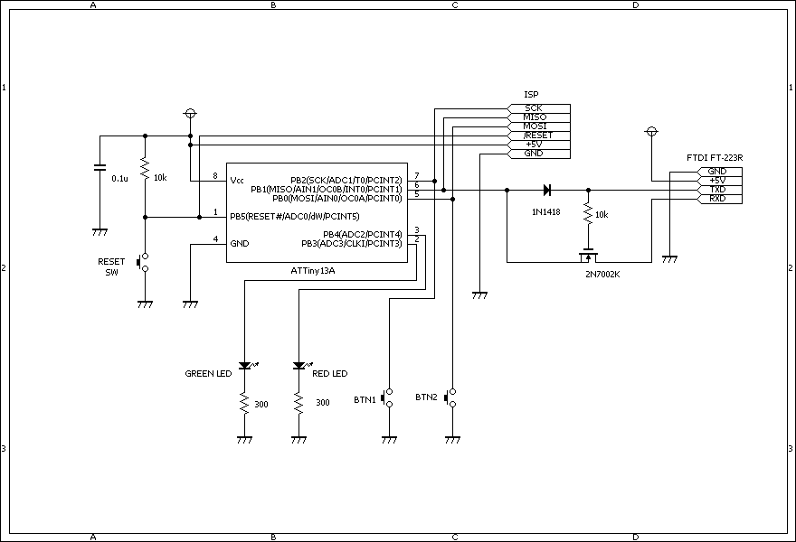

# ATTiny13Aで割り込みを利用したパソコンとのシリアル通信

[AVR half-duplex software UART supporting single pin operation](http://nerdralph.blogspot.ca/2014/01/avr-half-duplex-software-uart.html)
を利用して、ATTiny13Aの1ピンのみを使用したUART通信を、INT0を使ってRxの待ち受けを行います。

## 開発環境
OSX Yosemite

[CrossPack for AVR](https://www.obdev.at/products/crosspack/index.html)

[AVRISPmk2](http://www.atmel.com/ja/jp/tools/avrispmkii.aspx)

## 使用パーツ

* ATTiny13A
* タクトスイッチ x3
* LED x2
* 300Ω抵抗 x2
* 10KΩ抵抗 x2
* 0.1μF コンデンサ x1
* ダイオード 1N1418 x1
* MOSFET 2N7002K x1
* FT-232RL使用USB-シリアルアダプタ

## 回路図

## 注意
ISPとFT-232Rとの両方から電源を供給しないこと。(AVRISPmk2の場合電源は供給ではなく電圧を検知するのに使われる様子。)

## ビルドとインストール

事前に CrossPack for AVRのインストールと、パスを通しておく。

	$ git clone https://github.com/mamemomonga/ATT13A_Serial_INT0.git

	$ make

	(フューズビットを書き込む場合)
	$ make fuse

	$ make flash

## 利用方法

適当なシリアルターミナルをつかってボーレート38400で接続。GNU screenの場合は

	$ screen /dev/cu.usbserial-XXXXXXXX 38400

というような感じ。

## 参考サイト

[AVR half-duplex software UART supporting single pin operation](http://nerdralph.blogspot.ca/2014/01/avr-half-duplex-software-uart.html)

[猫にコ・ン・バ・ン・ワ ATtiny13Aでシリアル通信(UART)を行う](http://nuneno.cocolog-nifty.com/blog/2014/11/attiny13aiuart-.html)

